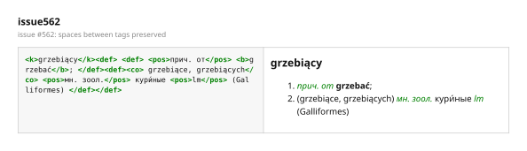
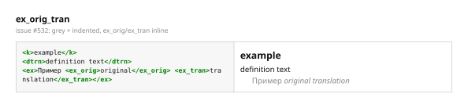
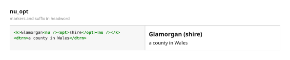
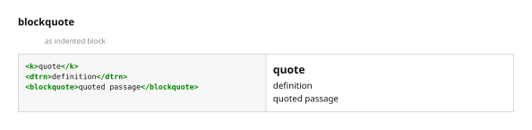
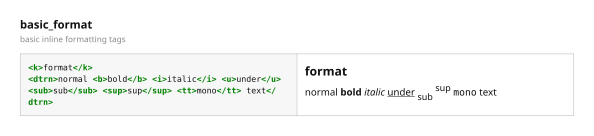
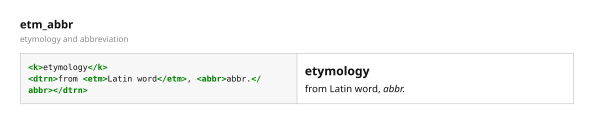
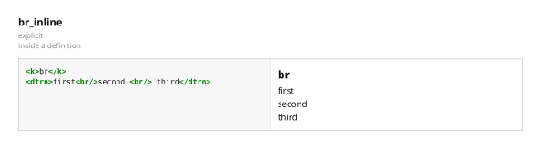

# XDXF transform: event-driven state machine

The XDXF format describes dictionary articles as XML markup (headwords,
transcriptions, parts of speech, cross-references, examples, images, etc.).
When converting an XDXF dictionary to another format, PyGlossary renders this
markup as HTML.

Most plugins use the XSLT transform ([`xdxf.xsl`](../../pyglossary/xdxf/xdxf.xsl))
via `lxml`, which is the highest-fidelity renderer. This document describes the
pure-Python fallback that runs when XSLT is unavailable:

- `pyglossary/xdxf/py_transform.py` — `XdxfTransformer`

It is used by the XDXF, XDXF Lax and StarDict readers, the AppleDict and
Ayandict writers, and by entry merging. It must therefore produce output that
is both correct and consistent across all of them.

## Problems with the previous implementation

The original pure-Python transformer converted each XDXF tag with a recursive
`writeChildrenOf` / `writeChildElem` walk. Each element handler recursively
processed its children, and text nodes were written by a single `writeString`
routine that tracked cross-sibling state (`hasPrev` / `hasPrevText`) to decide
where to insert line breaks and separators.

That bookkeeping was hard to reason about and repeatedly broke:

- [#562](https://github.com/ilius/pyglossary/issues/562) — *XDXF: XdxfTransformer removes spaces around XML tags*. Text nodes consisting only of whitespace were dropped entirely, and trailing whitespace was stripped from every text node, so the spaces between tags like `<pos>прич. от</pos> <b>grzebać</b>` disappeared and words were glued together.
- [#532](https://github.com/ilius/pyglossary/issues/532) — *XDXF in StarDict formatting issues*:
  - spaces before `kref` tags were removed,
  - `\n` in the source was not rendered as a line break,
  - content was not indented,
  - `<ex>` examples were neither grey nor indented.

Both issues stemmed from the same root cause: the transformer was trying to
manage whitespace that HTML renderers already handle. A browser collapses runs
of whitespace to a single space, inserts line breaks at block elements, and
ignores whitespace at block boundaries. Re-implementing that by hand, per
sibling, was error-prone.

## The state machine approach

`py_transform.py` was rewritten as a small event-driven state machine, the
same pattern used by the DSL transformer ([`doc/dsl/README.rst`](../dsl/README.rst),
based on Rob Pike's "Lexical Scanning" talk).

The article XML is walked in document order as a flat stream of events, each
an instance of one of three dataclasses:

- `_StartEvent(tag, attrs, element)`
- `_TextEvent(text)`
- `_EndEvent(tag)`

`transform()` is the state-machine loop: it feeds each event to one of three
handlers — `_onStart`, `_onText`, `_onEnd` — and the handlers append to a
single output buffer.

Central state (reset per article):

- `_out` — the accumulated HTML string,
- `_stack` — one entry per open tag, each an `_StackItem` dataclass carrying `(tag, lastSiblingWasBlock, payload)`,
- `_buf` — a text buffer used to render `<kref>`/`<iref>` links, whose `href`
  may fall back to their visible text.

Tag semantics are declarative. The `_OPEN_HTML` and `_CLOSE_HTML` maps say what
HTML a tag opens and closes:

```python
"abr": '<span class="abr"><font color="green"><i>',
"co": '<span class="co">(',
"ex": f'<div class="example" style="{_EX_STYLE}">',
```

Special tags (`def` list structure, `c` color, `img`, buffered links, void
`br`/`nu`/`rref`) are small explicit handlers rather than map entries.

### Whitespace: "like a browser"

Text handling is one function with three rules:

1. Text is written verbatim. HTML renderers collapse runs of whitespace, so
   spaces between inline tags are preserved.
2. A newline becomes `<br/>` (or a space inside inline contexts such as
   `<ex>`, `<deftext>`, `<categ>`, `<iref>`).
3. Leading whitespace after a block-level element is dropped, because a browser
   ignores it there anyway. `lastSiblingWasBlock` in the stack tracks whether
   the previous sibling in the current container was a block element (`k`,
   `def`, `ex`, `blockquote`, `sr`, `gr`, `tr`, `br`), which is what
   replaces the old `hasPrev`/`hasPrevText` logic.

### Rendering for limited HTML widgets

The output intentionally uses plain `<font>`/`<b>`/`<i>` tags and inline
`style` attributes rather than relying on an external stylesheet, so it also
renders acceptably in dictionary viewers and GUI widgets that support only a
subset of HTML and no CSS.

## What the rewrite fixes

- Spaces between tags, and around `kref`/`iref` links, are preserved
  ([#562](https://github.com/ilius/pyglossary/issues/562),
  [#532](https://github.com/ilius/pyglossary/issues/532)).
- Newlines in the source render as line breaks
  ([#532](https://github.com/ilius/pyglossary/issues/532)).
- `<ex>` examples are grey and indented
  ([#532](https://github.com/ilius/pyglossary/issues/532)).
- Multiple/nested `<def>` elements render as a numbered list, and `<co>`
  context is wrapped in parentheses, matching the XDXF-with-CSS plugin's
  presentation.
- `<br/>`, ``, `<nu>` markers and other empty tags are no longer dropped.
- The whole whitespace and nesting machinery is ~200 lines smaller and each
  event has exactly one handler, so the transform is much easier to reason
  about and extend.

## Verification

- Output is byte-identical to the previous recursive engine on the standard
  test corpus, and rendered-text-identical to the XDXF-with-CSS plugin on the
  LingvoUniversal 2008 dictionary (91 000+ entries) used to report
  [#532](https://github.com/ilius/pyglossary/issues/532).
- The test suite (`tests/xdxf_transform_test.py`) covers every tag and the
  reported issues with exact expected HTML.

## Examples

Each example below was rendered with the pure-Python transformer (XSLT disabled). The image shows the source XDXF markup on the left and the resulting HTML as a human reader would see it on the right.

### `issue562` — issue #562: spaces between tags preserved



### `kref_spaces` — issue #532: spaces before/after kref preserved


### `newlines` — issue #532: newlines render as line breaks


### `lingvo_entry` — issue #532: Lingvo-style entry with numbered defs, grey indented examples


### `ex_orig_tran` — issue #532: <ex> grey + indented, ex_orig/ex_tran inline



### `nested_defs` — nested <def> renders as a numbered list


### `single_def` — single <def> renders as a block


### `transcription` — transcription in brackets, <c>/<co>/<abr> inline formatting


### `image_ex` —  rendered self-closing inside definition and example


### `iref` — <iref> external link and audio speaker


### `nu_opt` — <nu> markers and <opt> suffix in headword



### `blockquote` — <blockquote> as indented block



### `gr_c` — <c> color tag and <gr> grammatical tag


### `basic_format` — basic inline formatting tags



### `etm_abbr` — <etm> etymology and <abbr> abbreviation



### `br_inline` — explicit <br/> inside a definition




